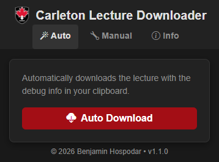
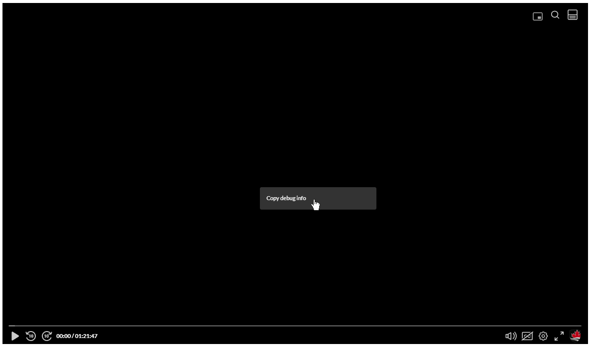
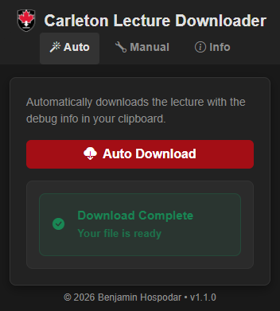
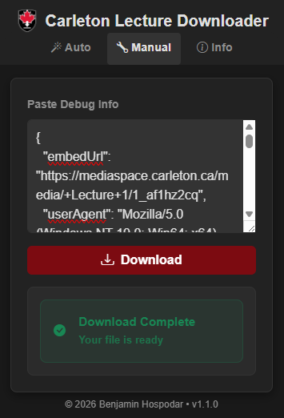

<div align="center">

# Carleton Lecture Downloader

**A lightweight Chrome extension for downloading lecture videos from Brightspace and Mediaspace.**

[](https://chromewebstore.google.com/detail/iokaghgiknoaonaimicjdjgjmcmpjeno?utm_source=item-share-cb)
[](LICENSE)



</div>

---

## Overview

Carleton Lecture Downloader lets you save Brightspace and Mediaspace lecture recordings directly to your computer. Copy the video's debug info, click the extension, and download — no sign-in, no tracking, no data collection.

> **Disclaimer:** This project is not affiliated with, endorsed by, or connected to Carleton University.

## Permissions

The extension requires the **`downloads`** permission so Chrome can save lecture videos to your computer. It also uses `clipboardRead` (Clipboard tab) and `storage` (theme preference). Video files are fetched only from Kaltura's CDN (`cdnapisec.kaltura.com`).

## Features

| Feature                 | Description                                                                                        |
| ----------------------- | -------------------------------------------------------------------------------------------------- |
| **Clipboard Download**  | Reads debug info from your clipboard and starts the download in one click.                         |
| **Paste Download**      | Fallback if clipboard access is blocked — paste debug info manually and download.                  |
| **Fast & Lightweight**  | Minimal footprint — popup-only UI with no background processes.                                    |
| **No Sign-in Required** | Works out of the box with zero account or registration steps.                                      |
| **Privacy First**       | No analytics or remote data collection; only local theme preference is stored.                     |

## Installation

### Chrome Web Store (Recommended)

1. Visit the **[Chrome Web Store listing](https://chromewebstore.google.com/detail/iokaghgiknoaonaimicjdjgjmcmpjeno?utm_source=item-share-cb)**.
2. Click **"Add to Chrome"**.
3. The extension icon will appear in your toolbar.

### Manual Installation (Developer Mode)

1. **Clone** this repository:
   ```
   git clone https://github.com/BenjaminHospodar/Carleton-Lecture-Downloader.git
   ```
2. Install dependencies and build:
   ```
   cd Carleton-Lecture-Downloader
   npm install
   npm run build
   ```
3. Open `chrome://extensions/` in Chrome.
4. Enable **Developer mode** (top-right toggle).
5. Click **"Load unpacked"** and select the **`dist/`** folder inside the cloned repository.

   > **Important:** Load the `dist/` folder, not the project root. Loading the root folder will cause a MIME type error because Chrome tries to run raw `.tsx` source files instead of the compiled JavaScript bundle.

6. The extension will appear in your toolbar.

### Development

```bash
npm install
npm run dev      # Vite dev server with HMR
npm run build    # Production build to dist/
npm test         # Run validator unit tests
```

Load the **`dist/`** folder in Chrome (Developer mode → Load unpacked) and keep the dev server running while developing. Changes to source files rebuild automatically.

> **Important:** Always load `dist/`, never the project root folder.

## Usage

### Clipboard Download (Recommended)

1. Navigate to a Brightspace or Mediaspace page with the lecture video.
2. Right-click the video player and select **"Copy debug info"**.

   

3. Click the extension icon in your toolbar.
4. On the **Clipboard** tab, click **Download**.
5. The video saves with its lecture filename.

   

### Paste Download

1. Right-click the video player and select **"Copy debug info"** (same as above).
2. Open the extension and switch to the **Paste** tab.
3. Paste the debug info into the text box.
4. Click **Download**.

   

## Project Structure

```
Carleton-Lecture-Downloader/
├── manifest.json
├── index.html
├── package.json
├── vite.config.ts
├── vitest.config.ts
├── tailwind.config.ts
├── src/
│   ├── popup/
│   │   ├── main.tsx
│   │   ├── App.tsx
│   │   ├── components/
│   │   │   ├── Header.tsx
│   │   │   ├── TabNav.tsx
│   │   │   ├── AutoTab.tsx
│   │   │   ├── ManualTab.tsx
│   │   │   ├── HelpPanel.tsx
│   │   │   ├── Button.tsx
│   │   │   ├── InstructionList.tsx
│   │   │   └── StatusMessage.tsx
│   │   └── hooks/
│   │       ├── useDownload.ts
│   │       └── useTheme.ts
│   ├── lib/
│   │   ├── constants.ts
│   │   ├── validator.ts
│   │   ├── validator.test.ts
│   │   ├── download.ts
│   │   └── types.ts
│   ├── styles/
│   │   └── index.css
│   └── vite-env.d.ts
├── icons/
│   └── 128.png
├── docs/
│   └── img/
├── LICENSE
└── README.md
```

## Troubleshooting

| Problem                     | Solution                                                                           |
| --------------------------- | ---------------------------------------------------------------------------------- |
| **Clipboard access denied** | Switch to the **Paste** tab and paste the debug info manually.                     |
| **JSON / missing fields**   | Ensure you copied debug info from the video player's right-click menu.             |
| **Download fails**          | Check your internet connection and verify the video plays in your browser.         |
| **Extension not updating**  | Run `npm run build`, then click **Reload** on `chrome://extensions`.             |
| **`downloads` API error**   | Reload the extension after installing or rebuilding so Chrome grants permissions.  |

## Support

- **Bug Reports** — [Open an issue](https://github.com/BenjaminHospodar/Carleton-Lecture-Downloader/issues)
- **Questions** — [Start a discussion](https://github.com/BenjaminHospodar/Carleton-Lecture-Downloader/discussions)

## License

This project is licensed under the **MIT License** — see [LICENSE](LICENSE) for details.

---

<div align="center">

**© 2026 Benjamin Hospodar**

</div>
